### AWS SYSOPS ADMINISTRATOR (SOA-C02) EXAM NOTES - David Galera, June 2025
- [EC2](#ec2)
- [ALB](#alb)
- [ASG](#asg)
- [EBS](#ebs)
- [EFS](#efs)
- [Storage Gateway](#storage-gateway)
- [SSM](#ssm)
- [Secrets Manager](#secrets-manager)
- [RDS](#rds)
- [ElastiCache](#elasticache)
- [S3](#s3)
- [Cloudtrail](#cloudtrail)
- [Config](#config)
- [Cloudformation](#cloudformation)
- [Service Advisor](#service-advisor)
- [Beanstalk](#beanstalk)
- [CloudWatch](#cloudwatch)
- [Cloudfront](#cloudfront)
- [VPC](#vpc)
- [Artifact](#artifact)
- [OpsWorks](#opsworks)
- [Trusted Advisor](#trusted-advisor)
- [Inspector](#inspector)
- [GuardDuty](#guardduty)
- [ACM](#acm)
- [Service Catalog](#service-catalog)
- [SSO](#sso)
- [KMS](#kms)
- [Organizations](#organizations)

## EC2
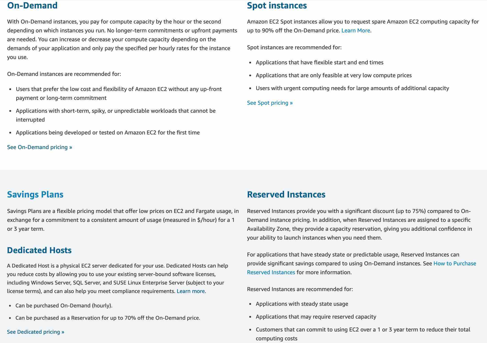
- `InstanceLimitExceeded` error when you try to launch a new instance or restart a stopped instance, you have reached the limit on the number of instances that you can launch in a **Region**
- `InsufficientInstanceCapacity` error when you try to launch a new instance or restart a stopped instance, AWS does not currently have enough available On-Demand capacity to fulfill your request.

**Burstable instances**
Provide a baseline level of CPU utilization with the ability to burst CPU utilization above the baseline level. The baseline utilization and ability to burst are governed by CPU credits.

The CPU credits used depends on CPU utilization. The following scenarios all use one CPU credit:

- One vCPU at 100% utilization for one minute
- One vCPU at 50% utilization for two minutes
- Two vCPUs at 25% utilization for two minutes

To resolve CPU throttling, you can either **enable T2/T3 Unlimited**, or **change the instance type with a higher CPU credit limit**. **T2 Unlimited** instances can sustain high CPU performance for as long as a workload needs it.

**termination protection**:
- **You can't enable termination protection for Spot Instances**. A Spot Instance is terminated when the Spot price exceeds the amount you're willing to pay for Spot Instances
- To prevent instances that are part of an ASG from terminating on scale in, use **instance protection**.
- To prevent Amazon EC2 Auto Scaling from terminating unhealthy instances, suspend the `ReplaceUnhealthy` process.
- To specify which instances Amazon EC2 Auto Scaling should terminate first, choose a termination policy.

The `DisableApiTermination` attribute controls whether the instance can be terminated using the console, CLI, or API

`Status checks ` are performed **every minute** at no charge, returning a pass or a fail status. If all checks pass, the overall status of the instance is OK. If one or more checks fail, the overall status is impaired. `Status checks` are built into Amazon EC2, so they cannot be disabled or deleted.

**AMIs**
- You can only share AMIs that have **unencrypted volumes** and volumes that are **encrypted with a customer-managed CMK**. If you share an AMI with encrypted volumes, you must also share any CMKs used to encrypt them.
- You do not need to share the Amazon EBS snapshots that an AMI references in order to share the AMI. Only the AMI itself needs to be shared; the system automatically provides the access to the referenced Amazon EBS snapshots for the launch.
- To make an AMI available in a different Region, copy the AMI to the Region and then share it. Sharing an AMI from different Regions is not available.

- `No reboot` -> **crash-consistent**, the instance is not shut down while creating the AMI. This option is **not selected by default**.
- It isn't possible to restore or recover a deleted or deregistered AMI. However, you can create a new, identical AMI using one of the following: 
  - EBS snapshots that were created as backups.
  - EC2 instances that were launched from the deleted AMI
- Linux Amazon Machine Images use one of two types of virtualization: **paravirtual (PV)** or **hardware virtual machine (HVM)**. All Regions support HVM AMIs. Linux paravirtual (PV) AMIs aren't supported in all AWS Regions.
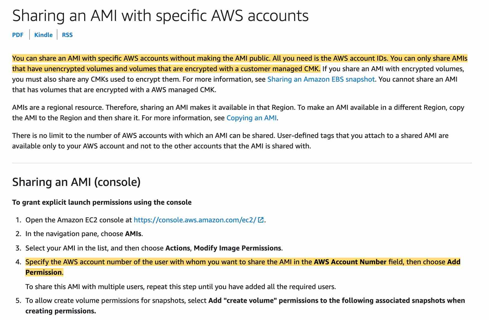

**Resizing**
- If your instance has a public IPv4 address, AWS releases the address and gives it a new public IPv4 address. The instance retains its private IPv4 addresses, any Elastic IP addresses, and any IPv6 addresses.
- Resizing of an instance is **only possible if the root device for your instance is an EBS volume** - If the root device for your instance is an EBS volume, you can change the size of the instance simply by changing its instance type, which is known as resizing it. If the root device for your instance is an instance store volume, you must migrate your application to a new instance with the instance type that you need.
- You must **stop your Amazon EBS–backed instance** before you can change its instance type. AWS moves the instance to new hardware; however, the instance ID does not change - You must stop your Amazon EBS–backed instance before you can change its instance type. When you stop and start an instance, AWS moves the instance to new hardware; however, the instance ID does not change.
- If your instance is in an Auto Scaling group, the Amazon EC2 Auto Scaling service marks the stopped instance as unhealthy, and may terminate it and launch a replacement instance - If your instance is in an Auto Scaling group, the Amazon EC2 Auto Scaling service marks the stopped instance as unhealthy, and may terminate it and launch a replacement instance. To prevent this, you can suspend the scaling processes for the group while you're resizing your instance.

**Enhanced Networking**

Consider using enhanced networking for the following scenarios:

- If your packets-per-second rate reaches its ceiling, consider moving to enhanced networking. If your rate reaches its ceiling, you've likely reached the upper thresholds of the virtual network interface driver.

- If your throughput is near or exceeding 20K packets per second (PPS) on the VIF driver, it's a best practice to use enhanced networking.

**Capacity Reservations**
- On-Demand Capacity Reservations enable you to reserve capacity for your Amazon EC2 instances in a specific Availability Zone for any duration.
- Capacity Reservations do not offer any billing discounts. You can combine Capacity Reservations with Savings Plans or Regional Reserved Instances to receive a discount.
- Capacity Reservations can be used with neither placement groups nor Dedicated Hosts.
- You can share Capacity Reservations with other AWS accounts.

**Spot Instances**
You can specify that Amazon EC2 should do one of the following when it interrupts a Spot Instance:
- Stop the Spot Instance
- Hibernate the Spot Instance
- Terminate the Spot Instance

The **default is to terminate Spot Instances** when they are interrupted.

AWS releases your instance's public IP address when it is `stopped`, `hibernated`, or `terminated`. Your `stopped` or `hibernated` instance receives a new public IP address when it is started.
## ALB
- `HTTP 503: Service unavailable will be received as response` is returned if the target groups for the load balancer have no registered targets.
- `HTTP 403: Forbidden will be returned` is returned if you configured an AWS WAF web access control list (web ACL) to monitor requests to your Application Load Balancer and it blocked the request.
- `HTTPCode_ELB_4XX_Count` metric stands for the number of HTTP 4XX client error codes that originate from the load balancer. This count does not include response codes generated by targets.

Open a support request with AWS to **pre-warm the load balancer**. AWS will need to know the start and end dates of your tests or expected flash traffic, the expected request rate per second, and the total size of the typical request/response that you will be testing

`ActiveConnectionCount` metric to auto scale. This metric represents the total number of concurrent TCP connections active from clients to the load balancer and from the load balancer to targets.

## ASG
Amazon EC2 Auto Scaling uses **service-linked roles (SLR)** for the required permissions to call other AWS services. The permissions for SLR are hardcoded by AWS and can't be changed. By default, permissions provided to Amazon EC2 Auto Scaling SLR don't include permissions to access customer master keys (CMKs). You can specify either role when you edit your **AWS Key Management Service** key policies to allow instances that are launched by Amazon EC2 Auto Scaling to be encrypted with your customer-managed CMK.

`Client.InternalError: Client error on launch` is thrown when an Auto Scaling group attempts to launch an instance that has an encrypted EBS volume, but the service-linked role does not have access to the customer-managed CMK used to encrypt it.
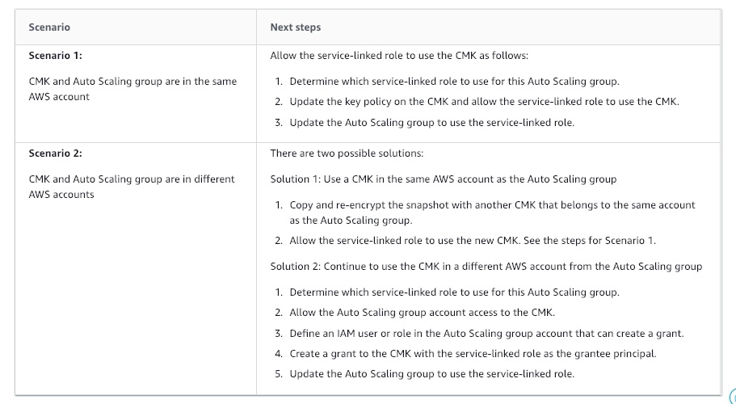

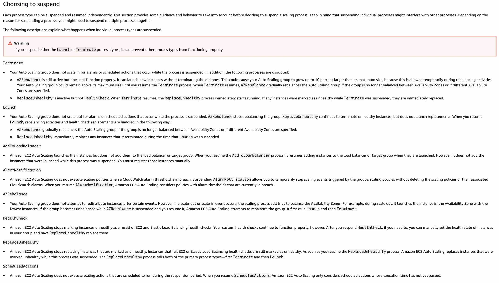
- If the `Terminate` process is suspended, your Auto Scaling group does not scale in for alarms or scheduled actions that occur.
- **ASG can grow up to 10 percent larger than its maximum size temporarily during rebalancing activities.**

`SpilloverCount` represents the total number of requests that were rejected because the **surge queue is full**. An increased maximum statistic for `SurgeQueueLength` indicates that backend systems aren't able to process incoming requests as fast as the requests are received. To solve this use-case, you need to configure the Auto Scaling groups to scale your instances based on the `SurgeQueueLength` metric.

Amazon EC2 Auto Scaling uses the value of the `HealthCheckGracePeriod` for the Auto Scaling group to determine how long to wait before checking the health status of the instance. By default, the health check grace period is 300 seconds when you create an Auto Scaling group from the AWS Management Console. Its default value is 0 seconds when you create an Auto Scaling group using the AWS CLI or an SDK.

ASG configuration can either consider `EC2 health status checks` or `ELB health status checks`, **not both**.

## EBS
- `EBS HDD volume - SC1` is backed by hard disk drives (HDDs) and provides the **lowest cost per GB** of all EBS volume types. It is ideal for less frequently accessed workloads with large, cold datasets
- `EBS HDD volume - ST1` is backed by hard disk drives (HDDs) and is **ideal for frequently accessed**, throughput intensive workloads with large datasets and large I/O sizes, such as MapReduce, Kafka, log processing, data warehouse, and ETL workloads.

The `error` status indicates that the underlying hardware related to your EBS volume has failed. The data associated with the volume is unrecoverable and Amazon EBS processes the volume as lost. A notification appears on your account's Personal Health Dashboard when a volume enters an error state.

An EBS (**io1 or io2**) volume, when configured with the new **Multi-Attach** option, can be attached to a maximum of 16 EC2 instances in a single Availability Zone. Additionally, each Nitro-based EC2 instance can support the attachment of multiple Multi-Attach enabled EBS volumes

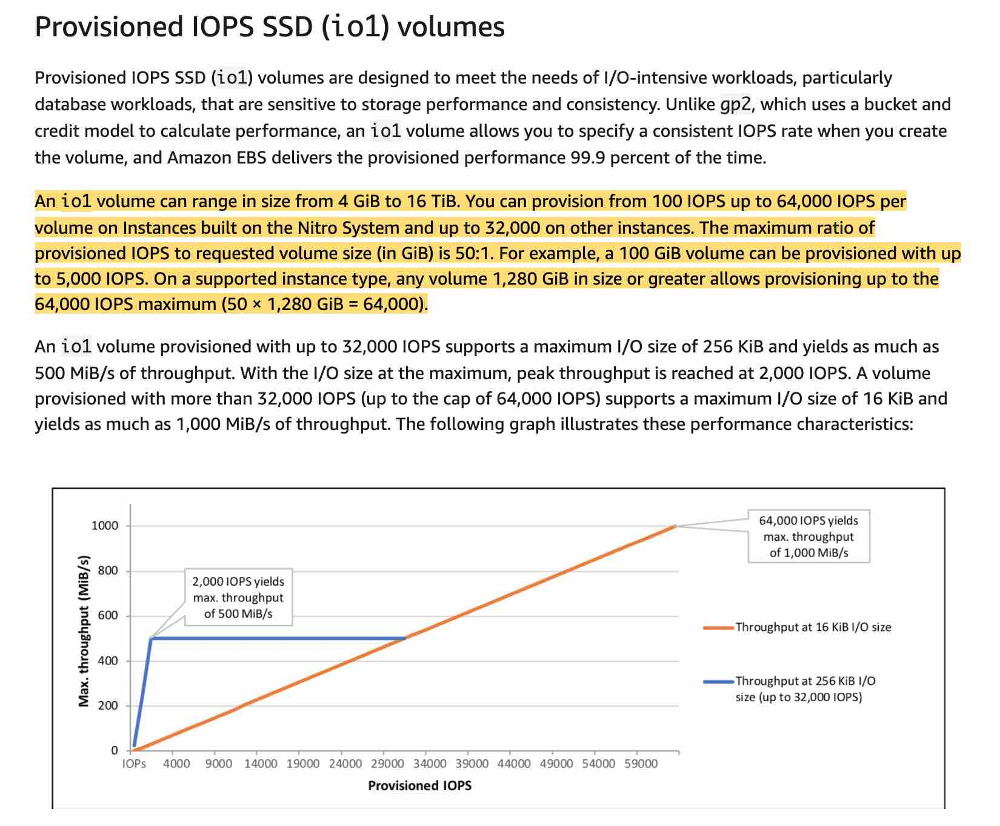

**RAID**
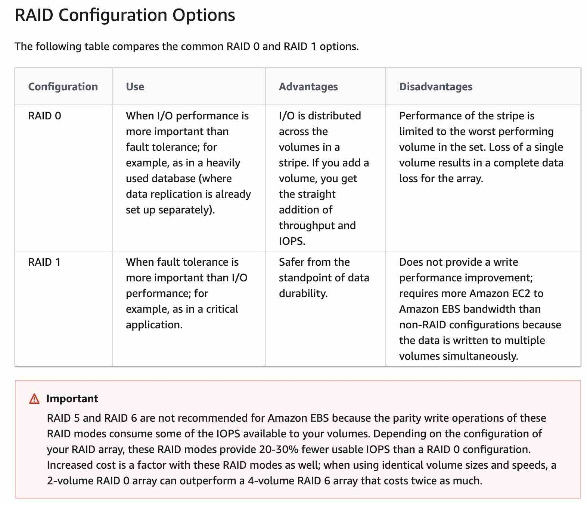

There is a significant increase in latency when you first access each block of data on a new EBS volume that was created from a snapshot. Solutions:
- Access each block before putting the volume into production. This process is called initialization (formerly known as **pre-warming**).
- Enable fast snapshot to restore on a snapshot to ensure that the EBS volumes created from it are fully-initialized at creation and instantly deliver all of their provisioned performance.

## EFS
To track the number of Amazon EC2 instances that are connected to a file system, you can monitor the `Sum` statistic of the `ClientConnections` metric. To calculate the average `ClientConnections` for periods greater than one minute, divide the sum by the number of minutes in the period.

**EFS mount helper**:
- Mounting with IAM authorization
- Auto-mounting when an EC2 instance reboots
## Storage Gateway
If your gateway or virtual machine malfunctions
- you can recover data that has been uploaded to AWS and stored on a volume in Amazon S3
- For cached volumes gateways, you recover data from a recovery snapshot
- For stored volumes gateways, you can recover data from your most recent Amazon EBS snapshot of the volume
- For tape gateways, you recover one or more tapes from a recovery point to a new tape gateway.

If your file system gets corrupted, you can use the `fsck` command to repair it.

**You can't decrease the size of a cache disk after it's allocated to an existing gateway**. Instead, you must create a new gateway with the cache space that you need. Then, you can migrate your data to the new gateway.

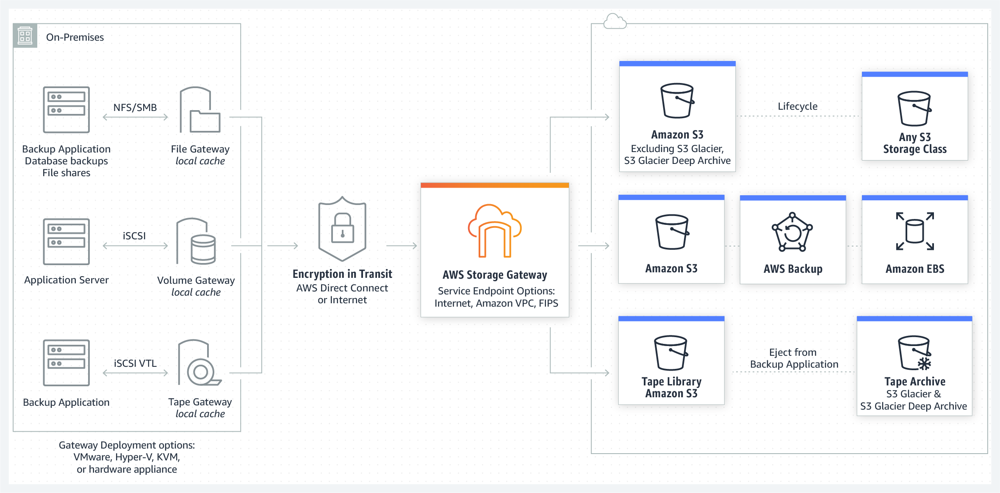
AWS Storage Gateway uses SSL/TLS (Secure Socket Layers/Transport Layer Security) to encrypt data that is transferred between your gateway appliance and AWS storage. By default, Storage Gateway uses Amazon S3-Managed Encryption Keys (SSE-S3) to server-side encrypt all data it stores in Amazon S3. You have an option to use the Storage Gateway API to configure your gateway to encrypt data stored in the cloud using server-side encryption with AWS Key Management Service (SSE-KMS) customer master keys (CMKs).

File, Volume and Tape Gateway data is stored in Amazon S3 buckets by AWS Storage Gateway. Tape Gateway supports backing data to Amazon S3 Glacier apart from the standard storage.

## SSM
- Run the `AWSSupport-TroubleshootS3PublicRead` automation document on AWS Systems Manager to help you diagnose issues with accessing objects from a public S3 bucket. Analyzes 403 errors from publicly readable objects. 
- Use the `AWSSupport-ExecuteEC2Rescue` document to recover impaired instances
- `AWS-UpdateCloudFormationStackWithApproval` document is used to update resources that were deployed by using CloudFormation template.
- Use the `AWS-UpdateWindowsAmi` document to recover impaired instances - You use the `AWS-UpdateLinuxAmi` and `AWS-UpdateWindowsAmi` documents to create golden AMIs from a source AMI.
**Systems Manager Automation** simplifies common maintenance and deployment tasks of EC2 instances and other AWS resources. Automation enables you to do the following: Build Automation workflows to configure and manage instances and AWS resources, Create custom workflows or use pre-defined workflows maintained by AWS, Receive notifications about Automation tasks and workflows by using Amazon EventBridge, Monitor Automation progress and execution details by using the Amazon EC2 or the AWS Systems Manager console

**AWS Systems Manager Patch Manager** automates the process of patching managed instances with both security-related and other types of updates. You can use Patch Manager to apply patches for both operating systems and applications. You can use Patch Manager to install Service Packs on Windows instances and perform minor version upgrades on Linux instances. You can patch fleets of EC2 instances or your on-premises servers and virtual machines (VMs) by operating system type.

**AWS Systems Manager Inventory** provides visibility into your Amazon EC2 and on-premises computing environment. You can use Inventory to collect metadata from your managed instances. You can store this metadata in a central Amazon Simple Storage Service (Amazon S3) bucket, and then use built-in tools to query the data and quickly determine which instances are running the software and configurations required by your software policy, and which instances need to be updated.

## Secrets Manager
Built-in rotation support for secrets for the following:
- Amazon RDS databases
- Amazon DocumentDB databases
- Amazon Redshift clusters

## RDS
**Aurora logs**

By design, Aurora Serverless connects to a proxy fleet of DB instances that scales automatically. Because there isn't a direct DB instance to access and host the log files, you can't view the logs directly from the Amazon Relational Database Service (Amazon RDS) console. However, you can view and download logs that are sent to the CloudWatch console.

To enable logs, first modify the cluster parameter groups for an Aurora serverless cluster. For MySQL-compatible DB clusters, you can enable the slow query log, general log, or audit logs.
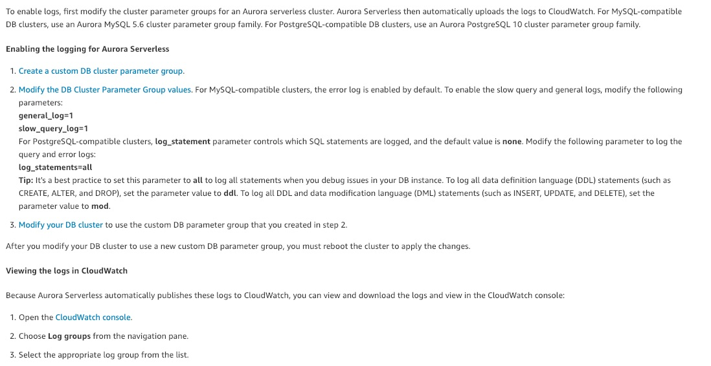

**Enhanced Monitoring** for RDS provides the following OS metrics: 1.Free Memory 2.Active Memory 3.Swap Free 4.Processes Running 5.File System Used

**Performance Insights** collects metric data from the database engine to monitor the actual load on a database. 

**For Amazon Aurora DB instances, you can't choose a specific subnet**. Instead, choose a DB subnet group when you create the instance. A DB subnet group is a collection of subnets that belong to a VPC. When it creates the underlying host, Amazon RDS randomly chooses a subnet from the DB subnet group.

`AuroraReplicaLagMaximum` - This metric captures the maximum amount of lag between the primary instance and each Aurora DB instance in the DB cluster.

## ElastiCache
- Redis replication is **asynchronous**. Therefore, when a primary node fails over to a replica, a small amount of data might be lost due to replication lag.
- When choosing the replica to promote to primary, ElastiCache for Redis chooses the replica with the least replication lag.
- When you manually promote read replicas to primary on Redis (cluster mode disabled), you can do so only when Multi-AZ and automatic failover are disabled
- A customer-initiated reboot of a primary doesn't trigger automatic failover. Other reboots and failures do trigger automatic failover

**Memcached**
With Amazon ElastiCache Memcached engine you cannot modify the node type. The way to scale up is to create a new cluster and specify the new node type. 

## S3
- A `503 service unavailable error` is most likely caused by too many requests coming in within a very short period of time
- You can retrieve 10 GB of your **Amazon S3 Glacier** data per month for free.
- You cannot enable **default encryption** on objects, you enable it at the **bucket level**.

**Object Lock Governance mode**
When the S3 Object Lock is set in governance mode, it prevents users from overwriting or deleting any version of the object unless they have special permissions. One of these permissions is the '`s3:BypassGovernanceRetention`' IAM permission, which allows a user to bypass the governance mode restrictions. Therefore, the SysOps administrator would need this permission to delete the objects.

To bypass governance mode, you must explicitly indicate in your request that you want to bypass this mode. To do this, include the `x-amz-bypass-governance-retention:true` **header** with your request, or use the equivalent parameter with requests made through the AWS CLI, or AWS SDKs.

Together, these two steps allow the SysOps administrator to delete the unnecessary data from the S3 bucket.

**S3 Replication Time Control (S3 RTC)** helps you meet compliance or business requirements for data replication and provides visibility into Amazon S3 replication times. S3 RTC replicates most objects that you upload to Amazon S3 in seconds, and 99.99 percent of those objects within 15 minutes.

S3 RTC by default includes S3 replication metrics and S3 event notifications

**MFA delete** requires additional authentication for either of the following operations:
- Change the versioning state of your bucket
- Permanently delete an object version

The bucket owner (root account) can enable MFA Delete only via the **AWS CLI**

You cannot delete an S3 bucket if **delete markers** are present (bucket not empty error).

In-place switch from unencrypted to encrypted, encryption works at object level.

**Retention Periods**

A `retention period` protects an object version for a fixed amount of time.After the retention period expires, the object version can be overwritten or deleted unless you also placed a legal hold on the object version. This is where the `lifecycle policy` kicks. You can place a retention period on an `object version` either explicitly or through a bucket default setting.

When you use bucket default settings, you don't specify a `Retain Until Date`. Instead, you specify a duration, in either days or years, for which every object version placed in the bucket should be protected.

`Object Lock` works **only in versioned buckets**, and `retention periods` and `legal holds` apply to individual object versions.

## Cloudtrail
Cloudtrail **log files** and **digest files** are stored in the **same s3 bucket**.

By default, the **log files** delivered by CloudTrail to your bucket are encrypted by Amazon server-side encryption with Amazon S3-managed encryption keys (SSE-S3). To provide a directly manageable security layer, you can instead use server-side encryption with AWS KMS–managed keys **(SSE-KMS) for your CloudTrail log files**. Enabling server-side encryption encrypts the log files but not the digest files with SSE-KMS. **Digest files are encrypted with Amazon S3-managed encryption keys (SSE-S3)**.

When you enable `log file integrity validation`, CloudTrail creates a hash for every log file that it delivers. Every hour, CloudTrail also creates and delivers a file that references the log files for the last hour and contains a hash of each. This file is called a digest file. CloudTrail signs each digest file using the private key of a public and private key pair. After delivery, you can use the public key to validate the digest file. CloudTrail uses different key pairs for each AWS region.

## Config
When you add a rule to your account, you can specify when you want AWS Config to run the rule; this is called a trigger. AWS Config evaluates your resource configurations against the rule when the trigger occurs. There are two types of triggers:

- Configuration changes: AWS Config runs evaluations for the rule when certain types of resources are created, changed, or deleted.
- Periodic: AWS Config runs evaluations for the rule at a frequency that you choose (for example, every 24 hours).
  
**A rule can have 2 triggers.**

`AWS Config` sends notifications **only when the compliance status changes**. If a resource was previously non-compliant and is still non-compliant, Config will not send a new notification.

Amazon EC2 deletes the Amazon EBS volume that has the `DeleteOnTermination` attribute set to true, but it does not publish the `DeleteVolume` API call. This is because AWS Config uses the `DeleteVolume` API call as a trigger with the rule, and the resource changes aren't recorded for the EBS volume. The EBS volume still shows as compliant or noncompliant.

AWS Config performs a baseline every six hours to check for new configuration items with the `ResourceDeleted` status. The AWS Config rule then removes the deleted EBS volumes from the evaluation results.
## Cloudformation
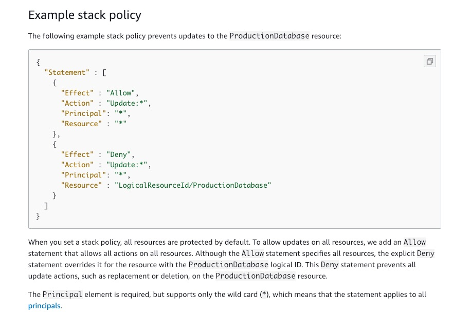

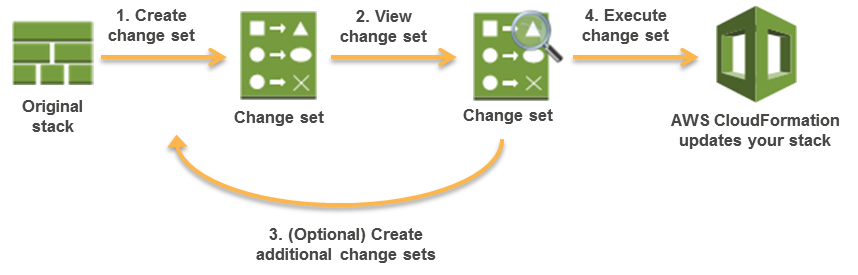

- `Parameter constraints` describe allowed input values so that AWS CloudFormation catches any invalid values before creating a stack. You can set constraints such as a minimum length, maximum length, and allowed patterns.
- `!GetAtt` - The Fn::GetAtt intrinsic function returns the value of an attribute from a resource in the template. This example snippet returns a string containing the DNS name of the load balancer with the logical name myELB - YML : `!GetAtt` myELB.DNSName JSON : "Fn::GetAtt" : [ "myELB" , "DNSName" ]
- `!ImportValue` The intrinsic function Fn::ImportValue returns the value of an output exported by another stack. You typically use this function to create cross-stack references.
- `!Ref` - Returns the value of the specified parameter or resource.
- `!Sub` - Substitutes variables in an input string with values that you specify.

The `cfn-init` helper script reads template metadata from the AWS::CloudFormation::Init key and acts accordingly to:

- Fetch and parse metadata from AWS CloudFormation

- Install packages

- Write files to disk

- Enable/disable and start/stop services

The `cfn-signal` helper script signals AWS CloudFormation to indicate whether Amazon EC2 instances have been successfully created or updated. If you install and configure software applications on instances, you can signal AWS CloudFormation when those software applications are ready.

You can use the wait condition handle to make AWS CloudFormation pause the creation of a stack and wait for a signal before it continues to create the stack. For example, you might want to download and configure applications on an Amazon EC2 instance before considering the creation of that Amazon EC2 instance complete.

AWS CloudFormation creates a wait condition just like any other resource. When AWS CloudFormation creates a wait condition, it reports the wait condition’s status as CREATE_IN_PROGRESS and waits until it receives the requisite number of success signals or the wait condition’s timeout period has expired. If AWS CloudFormation receives the requisite number of success signals before the time out period expires, it continues creating the stack; otherwise, it sets the wait condition’s status to CREATE_FAILED and rolls the stack back.

A `cfn-init` script failure is still be followed by the `cfn-signal` script. The **Timeout** property determines how long AWS CloudFormation waits for the requisite number of success signals. Timeout is a minimum-bound property, meaning the timeout occurs no sooner than the time you specify, but can occur shortly thereafter. The maximum time that you can specify is 43200 seconds (12 hours ). The **stack creation can fail** if CloudFormation fails to receive a signal from your EC2 instance if the **Timeout property is set to a low value**.

You cannot delete stacks that have termination protection enabled. The deletion fails and the stack - including its status - remains unchanged.

This includes nested stacks whose root stacks have termination protection enabled. Disable termination protection on the root stack, then perform the delete operation again. It is strongly recommended that you do not delete nested stacks directly, but only delete them as part of deleting the root stack and all its resources.

You must delete all objects in an Amazon S3 bucket or remove all instances in an Amazon EC2 security group before you can delete the bucket or security group. Otherwise, stack deletion fails and the stack will be in the DELETE_FAILED state.

If you created an AWS resource outside of AWS CloudFormation management, you can bring this existing resource into AWS CloudFormation management using `resource import`.

Performing a **drift detection** operation on a stack determines whether the stack has drifted from its expected template configuration, and returns detailed information about the drift status of each resource in the stack that supports drift detection.

To control how AWS CloudFormation handles the EBS volume when the stack is deleted, set a deletion policy for your volume. You can `delete`, `retain` or create a `snapshot`.

When you create a stack, all update actions are allowed on all resources. By default, anyone with stack update permissions can update all of the resources in the stack. You can prevent stack resources from being unintentionally updated or deleted during a stack update by using a `stack policy`. After you set a stack policy, all of the resources in the stack are protected by default. A **stack policy applies only during stack updates**.

You can use the `OnFailure` property of the CloudFormation CreateStack call for this use-case. The `OnFailure` property determines what action will be taken if stack creation fails. This must be one of `DO_NOTHING`, `ROLLBACK`, or `DELETE`.

**Cross-stack references**
To create a cross-stack reference, use the `Export output` field to flag the value of a resource output for export. Then, use the `Fn::ImportValue` intrinsic function to import the value.

Stack outputs are displayed on screen when stack is runned from AWS CLI

The `ROLLBACK_COMPLETE` status indicates the successful removal of one or more stacks after a failed stack creation or after an explicitly canceled stack creation. Any resources that were created during the create stack action are deleted.

This status exists only after a failed stack creation. It signifies that all operations from the partially created stack have been appropriately cleaned up. When in this state, only a delete operation can be performed.

**STACK SETS**
Stack sets can be created using either **self-managed permissions** or **service-managed permissions**. With service-managed permissions, you can deploy stack instances to accounts managed by AWS Organizations. Using this permissions model, you don't have to create the necessary IAM roles; StackSets creates the IAM roles on your behalf.
- You must set up a trust relationship between the administrator (An administrator account is the AWS account in which you create stack sets) and target accounts before creating stacks in target accounts

## Service Advisor
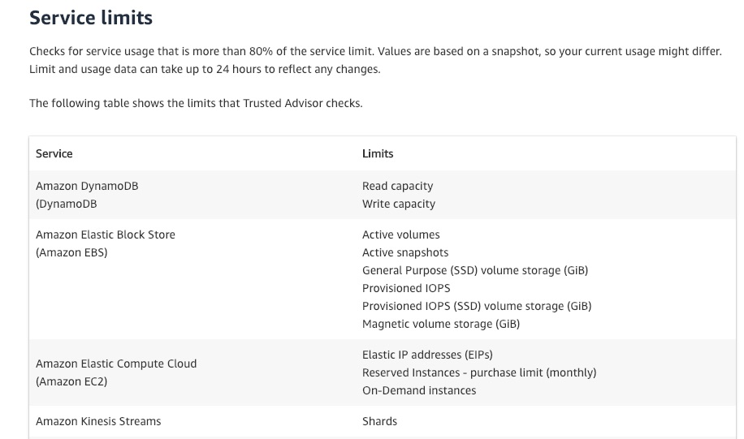

## Beanstalk
ASG 2 default `cloudwatch alarms`: Average outbound network traffic (`NetworkOut`) from each instance is higher than 6 MB or lower than 2 MB over a period of five minutes.

## CloudWatch
You can retrieve custom metrics from your applications or services using the `StatsD` and `collectd` protocols.
- `StatsD` is supported on both **Linux and Windows Server**.
- `collectd` is supported only on **Linux**.

**Detailed Monitoring**
After you enable detailed monitoring, the Amazon EC2 console displays monitoring graphs with a 1-minute period for the instance. In Basic monitoring, data is available automatically in 5-minute periods at no charge.

**Canaries**

Canaries are Node.js scripts. They create Lambda functions in your account that use Node.js as a framework. Canaries work over both HTTP and HTTPS protocols.

UI canaries offer programmatic access to a headless Google Chrome Browser via Puppeteer. For more information about Puppeteer, see Puppeteer.

Canaries check the availability and latency of your endpoints and can store load time data and screenshots of the UI. They monitor your REST APIs, URLs, and website content, and they can check for unauthorized changes from phishing, code injection and cross-site scripting.

You can run a canary once or on a regular schedule. Scheduled canaries can run 24 hours a day, as often as once per minute

**Cloudwatch metrics**
- `StatusCheckFailed` - Reports whether the instance has passed both the instance status check and the system status check in the last minute.
- `StatusCheckFailed_Instance` - Reports whether the instance has passed the instance status check in the last minute.
- `StatusCheckFailed_System` - Reports whether the instance has passed the system status check in the last minute.
  
The only dimension that **Amazon SQS** sends to CloudWatch is `QueueName`. This means that all available statistics are filtered by `QueueName`.

**CloudWatch Agent**: Any configuration files appended to the configuration **must have different file names** from each other and from the initial configuration file. If you use `append-config` with a configuration file with the same file name as a configuration file that the agent is already using, the append command overwrites the information from the first configuration file instead of appending to it. This is true even if the two configuration files with the same file name are on different file paths.

**CW alarms** action can only have the following targets:
- EC2 action
- ASG action
- SNS
- Creating a Systems Manager OpsItem

Using `Amazon CloudWatch alarm actions`, you can create alarms that automatically `stop`, `terminate`, `reboot`, or `recover` your EC2 instances. You can use the stop or terminate actions to help you save money when you no longer need an instance to be running. You can use the reboot and recover actions to automatically reboot those instances or recover them onto new hardware if a system **impairment** occurs
## Cloudfront
If your Amazon **S3 bucket is configured as a website endpoint**, you can't configure CloudFront to use HTTPS to communicate with your origin because Amazon S3 doesn't support HTTPS connections in that configuration.

## VPC
**CNAME records** can be used to map one domain name to another. Although you should keep in mind that the DNS protocol does not allow you to create a CNAME record for the top node of a DNS namespace, also known as the zone apex. For example, if you register the DNS name example.com, the zone apex is example.com. You cannot create a CNAME record for example.com, but you can create CNAME records for www.example.com, newproduct.example.com, and so on.

Troubleshooting flow logs:
- The IAM role for your flow log does not have sufficient permissions to publish flow log records to the CloudWatch log group
- The IAM role does not have a trust relationship with the flow logs service
- The trust relationship does not specify the flow logs service as the principal

After you've created a flow log, you cannot change its configuration or the flow log record format
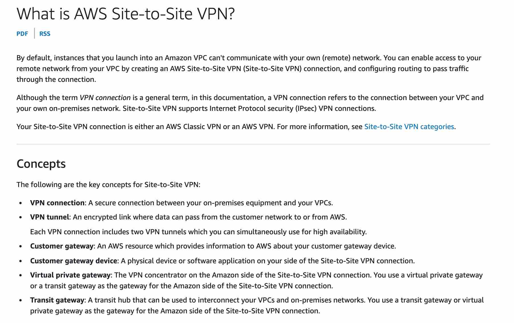

- 2 123456789011 eni-5432a9dc987654321 10.0.1.23 172.32.17.148 60004 8081 1 4 350 1432918128 1432918243 ACCEPT OK
- 2 123456789011 eni-5432a9dc987654321 172.32.17.148 10.0.1.23 8081 60004 1 4 350 1432918195 1432918243 REJECT OK

The second entry in the log file shows that the traffic was rejected. The flow logs indicate that the traffic was blocked when it tried to connect from the EC2 instance (172.32.17.148) on port 8081 to the on-premises system (10.0.1.23) on ephemeral port 60004.

The rejection of traffic suggests that there is a network-level block preventing the outbound traffic from the EC2 instance. Since the flow logs indicate that the rejection occurred due to the ephemeral port range (60004) being blocked, it implies that the network ACL associated with the subnet where the EC2 instances reside is the cause of the issue.
## Artifact
AWS Artifact is a self-service audit artifact retrieval portal that provides our customers with **on-demand access to AWS’ compliance documentation and AWS agreements**.

## OpsWorks
AWS OpsWorks is a configuration management service that provides managed instances of **Chef and Puppet**.

## Trusted Advisor
AWS Trusted Advisor is an online tool that provides you real-time guidance to help you provision your resources following AWS best practices.

You can use **AWS Trusted Advisor’s Service Limit Dashboard** to determine whether the service limits for EC2 instances have been reached

## Inspector
Amazon Inspector is an automated security assessment service that helps you test the network accessibility of your Amazon EC2 instances and the security state of your applications running on the instances.

An Amazon Inspector assessment report can be generated for an assessment run once it has been successfully completed. An assessment report is a document that details what is tested in the assessment run, and the results of the assessment. The results of your assessment are formatted into a standard report, which can be generated to share results within your team for remediation actions, to enrich compliance audit data, or to store for future reference.

You can select from two types of report for your assessment, a **findings report** or a **full report**
- **findings report** contains an executive summary of the assessment, the instances targeted, the rules packages tested, the rules that generated findings, and detailed information about each of these rules along with the list of instances that failed the check
- **full report** contains all the information in the findings report and additionally provides the list of rules that were checked and passed on all instances in the assessment target

## GuardDuty

## ACM
- Only SSL/TLS certificates
- ACM certs cannot be used for email encryption
- You won't find the imported certificate or ACM certificate if:
  - The certificate imported into ACM is using an algorithm other than 1024-bit RSA or 2048-bit RSA.
  - The ACM certificate wasn't requested in the same AWS Region as your load balancer or CloudFront distribution.

## Service Catalog
You can share portfolios in several ways, including **account-to-account sharing**, **organizational sharing**, and deploying catalogs using stack sets (creates independent copies).

## SSO
**Permission sets** define the level of access that users and groups have to an AWS account. Permission sets are stored in AWS SSO and provisioned to the AWS account as IAM roles.

## KMS
When you import key material into a CMK, the CMK is permanently associated with that key material. You can reimport the same key material, but you cannot import different key material into that CMK. Also, you cannot enable automatic key rotation for a CMK with imported key material. However, you can manually rotate a CMK with imported key material.

Therefore, the best solution is to create a new CMK and import new key material into it. The alias in the application code can then be updated to point to the new CMK.

## Organizations
User-defined tags are tags that you define, create, and apply to resources. After you have created and applied the user-defined tags, you can activate by using the Billing and Cost Management console for cost allocation tracking. **Cost Allocation Tags** appear on the console after you've enabled Cost Explorer, Budgets, AWS Cost and Usage reports, or legacy reports.

When using AWS Organizations, you must use the **Billing and Cost Management console in the payer account** to mark the tags as cost allocation tags. You can use the **Cost Allocation Tags manager** to do this.